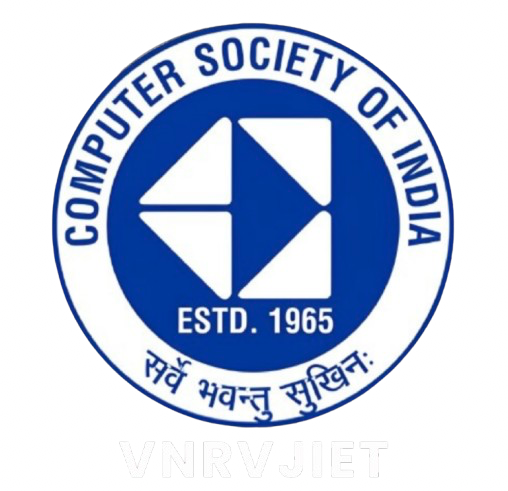

# FlashForte 2K26



Welcome to the official web portal for **FlashForte 2K26** — a premier multi-disciplinary tech event hosted by **CSI-VNRVJIET**. Step into the multiverse and experience a fusion of technology, design, and innovation.

##  Features

- **Sci-Fi Aesthetic**: A premium, "Deep Space Navy" dark mode UI featuring glowing typography, smooth gradients, and glassmorphic elements.
- **Dynamic Routing**: Instant client-side navigation powered by **React Router v7** for a seamless, app-like experience.
- **Mobile First**: Fully responsive layouts ensuring the multiverse looks incredible on any device or viewport.
- **Event Ecosystem**: Dedicated routing and landing pages for all flagship events:
  -  **IdeaThon**
  -  **Game-A-Thon**
  -  **Speak-A-Thon**
  -  **Design-A-Thon**

##  Tech Stack

This project is built using modern, lightning-fast web technologies:

- **Framework**: [React 18](https://react.dev/)
- **Build Tool**: [Vite](https://vitejs.dev/)
- **Routing**: [React Router v7](https://reactrouter.com/)
- **Styling**: [Tailwind CSS v4](https://tailwindcss.com/)
- **Icons**: [Lucide React](https://lucide.dev/)

##  Getting Started

### Prerequisites

Make sure you have [Node.js](https://nodejs.org/) installed on your machine.

### Installation

1. Clone the repository:
   ```bash
   git clone <repository-url>
   ```
2. Navigate into the project directory:
   ```bash
   cd FlashForte
   ```
3. Install the dependencies:
   ```bash
   npm install
   ```

### Running Locally

To start the local development server:

```bash
npm run dev
```

Your app will be running at `http://localhost:5173/`.

### Building for Production

To create an optimized production build:

```bash
npm run build
```

This will generate a `dist` folder containing the minified assets ready for deployment.
