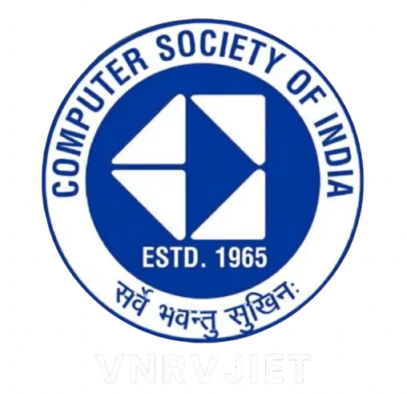

# FlashForte 2K26



## About FlashForte

**FlashForte 2K26** is the official web portal for the flagship first-year event organized by the **Computer Society of India (CSI) – VNRVJIET**.

It brings together students from diverse backgrounds to explore creativity, innovation, communication, and strategic thinking through a series of competitions and challenges. The platform allows participants to discover events, explore schedules, and stay updated throughout the competition.

## The Four Fortes

### Speak-a-thon
Focuses on communication, storytelling, and spontaneous thinking. Participants are challenged to express ideas clearly and demonstrate creativity through spoken word.

### Design-a-thon
Celebrates visual storytelling and design thinking. Participants transform ideas into visual experiences, exploring themes that inspire innovation and meaningful communication.

### Ideathon
Provides a platform for innovators to identify real-world challenges and propose impactful solutions. It encourages structured thinking, problem-solving, and idea pitching.

### Game-a-thon
Combines entertainment, strategy, and competition. Through interactive challenges, participants test adaptability, critical thinking, teamwork, and decision-making skills.

## Features

* Responsive design for desktop and mobile devices
* Interactive event and schedule exploration
* Previous year highlights
* Registration and participation tracking

## Tech Stack

* React
* JavaScript
* Tailwind CSS
* Framer Motion
* Vite
* React Router
* Lucide React
* Vercel

## Getting Started

### Prerequisites

Make sure you have Node.js installed on your machine.

### Installation

1. Clone the repository:
   ```bash
   git clone https://github.com/<your-username>/FlashForte.git
   cd FlashForte
   ```

2. Install dependencies:
   ```bash
   npm install
   ```

3. Start the development server:
   ```bash
   npm run dev
   ```

4. Open in browser:
   Visit http://localhost:5173 to view the application.

### Production

Build the application:
```bash
npm run build
```

To preview the production build locally:
```bash
npx vite preview
```

## Project Structure

```text
FlashForte/
├── public/           # Static public assets
├── src/
│   ├── app/          # App root, pages, and components
│   │   ├── components/ # Reusable React components
│   │   └── pages/      # Page components for routing
│   ├── images/       # Image assets
│   ├── styles/       # Global CSS styles
│   └── main.jsx      # React entry point
├── package.json      # Dependencies and scripts
├── vite.config.js    # Vite configuration
└── vercel.json       # Vercel deployment configuration
```

## Organization

Developed and maintained by the **Computer Society of India (CSI) – VNRVJIET**.

## License

This project is intended for the official FlashForte event conducted by CSI VNRVJIET.
All rights reserved.
